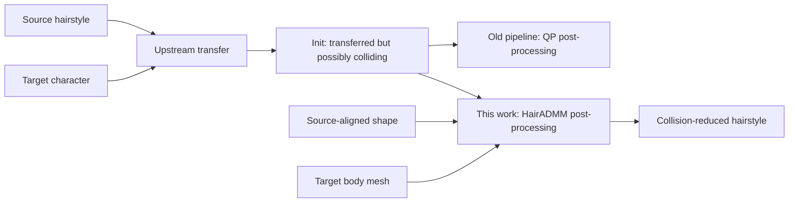

# HairADMM

**A one-step ADMM post-processor for collision-aware hairstyle transfer**

## Abstract

HairADMM removes body penetrations from a transferred hairstyle while trying
to preserve the hairstyle produced by the original transfer method. It is a
replacement for the quadratic-programming (QP) post-processing stage in our
pipeline; it is **not** a method for generating or transferring a hairstyle
from scratch.

The central idea is to separate two tasks that are difficult to solve at the
same time:

1. preserve the transferred hairstyle; and
2. keep sampled points on every hair strand at least 1 mm outside the body.

ADMM alternates between these two tasks. A sparse linear solve updates the
hair shape, a signed-distance projection moves collision samples outside the
body, and a dual variable makes the two results agree. Uniform samples along
each hair segment and exact Embree intersection feedback address collisions
that vertex-only constraints can miss.

The release makes three contributions: a canonical tensor contract that keeps
the QP and ADMM hairstyle objectives aligned; an ADMM formulation that splits
sparse hairstyle reconstruction from exterior-body projection; and a
segment-aware constraint-generation scheme combining deterministic sampling
with exact Embree feedback. We evaluate the method on 2,702 frames and report
both aggregate improvements and remaining failure cases.

> **Scope of this release.** The released method is the final one-step spatial
> version: one Guide/Normal pass, a 1 mm exterior margin, segment samples no
> farther than 2 mm apart, and Embree feedback. It has no additional Edge
> energy, no temporal term or gate, and no second sequence-level pass.

---

## 1. Problem statement

### 1.1 What is a hairstyle in this project?

A hairstyle is a collection of polyline strands. Strand $s$ consists of 3D
points

$$
\mathbf{x}_{s,0},\mathbf{x}_{s,1},\ldots,
\mathbf{x}_{s,n_s-1}\in\mathbb{R}^3.
$$

Consecutive points form a straight segment. Point $\mathbf{x}_{s,0}$ is the
root attached to the scalp. Roots remain fixed during optimization; all other
points are variables.

The target body is an oriented triangle mesh

$$
\mathcal M=(V,F).
$$

The mesh represents the head and body that the hair must remain outside of.
All positions in the optimization files use metres.

### 1.2 What does “initial transfer” (`Init`) mean?

An upstream hairstyle-transfer method first moves a source hairstyle to a
target character. That upstream method may use skinning, root correspondence,
an affine transformation, a learned model, or another deformation method;
HairADMM does not prescribe it.

Its output is called the **initial transfer** or **Init**:

$$
\mathbf{x}^{\mathrm{init}}
=\{\mathbf{x}^{\mathrm{init}}_{s,j}\}.
$$

Init normally has the correct hairstyle and roughly correct root placement,
but some points or whole segments may pass through the target body. Moving
every colliding point independently would remove the penetration but could
destroy the hairstyle. HairADMM therefore treats Init as a shape target rather
than blindly projecting it.

In addition, the solver receives a **source-aligned hairstyle**
$\mathbf{x}^{\mathrm{src}}$. It is the source hairstyle expressed in the
same coordinate frame and with the same strand topology as Init. It supplies
the original strand directions and local cross-strand offsets that should be
preserved.

### 1.3 Input and output

For one frame, the conceptual input is:

- the initial transferred hair $\mathbf{x}^{\mathrm{init}}$;
- the source-aligned hair $\mathbf{x}^{\mathrm{src}}$;
- the target body mesh $\mathcal M$;
- strand topology and fixed roots;
- the Guide subset, KNN graphs, KNN weights, local weights, and energy weights.

The output is an optimized hairstyle $\mathbf{x}^{*}$ that remains close to
Init and to the source hairstyle's local structure while greatly reducing
body penetration.



Thus “one-step” means one HairADMM post-processing pass after Init. It does
not mean that HairADMM also performs the upstream hairstyle transfer.

---

## 2. What was the original QP?

The original pipeline also repaired Init after transfer. At each outer
iteration it formed a quadratic approximation of the hairstyle-preservation
objective and solved a constrained quadratic program. In simplified form,

$$
\begin{aligned}
\min_{\mathbf{x}}\quad & E_{\mathrm{base}}(\mathbf{x})\\
\text{s.t.}\quad &
\mathbf{n}_i^\top(\mathbf{x}_i-\mathbf{q}_i)\ge \varepsilon,
\qquad i\in\mathcal A.
\end{aligned}
$$

Here $\mathbf{q}_i$ is a nearby surface point, $\mathbf{n}_i$ is its
outward normal, $\varepsilon$ is a small clearance (0.1 mm in the historical
branch represented here), and $\mathcal A$ is the current set of colliding or
active hair vertices. Once the surface points, normals, and nonlinear
direction terms are frozen, both the objective and constraints are
quadratic/linear, hence the name QP.

The QP is important for two reasons:

1. it defines the historical baseline against which HairADMM is evaluated;
2. its base hairstyle objective is reused by HairADMM so that the comparison
   changes the collision-handling solver rather than silently changing the
   intended hairstyle.

The canonical `.npz` bundle in this repository is exported immediately before
the historical QP solve. HairADMM consumes the same Init, source alignment,
Guide selection, KNN graphs, KNN weights, local weights, and energy weights.

The limitation addressed here is primarily collision semantics. A constraint
on a vertex does not constrain the entire segment between two vertices. Two
endpoints can both be outside a surface while the straight segment joining
them still crosses it. Local tangent planes also describe only a local view of
a curved surface. HairADMM instead places sampled points along the segments in
an exterior signed-distance constraint and adds samples at residual exact
intersections.

We do **not** report a QP runtime speedup because a QP time measured under the
same timing protocol was not retained.

---

## 3. Shared hairstyle objective

HairADMM minimizes the same three base terms used by the QP-aligned pipeline:

$$
E_{\mathrm{base}}(\mathbf{x})
=E_{\mathrm{fit}}(\mathbf{x})
+E_{\mathrm{knn}}(\mathbf{x})
+E_{\mathrm{shape}}(\mathbf{x}).
$$

There is no additional edge-length or temporal energy in the released
configuration.

### 3.1 Fidelity to Init

$$
E_{\mathrm{fit}}(\mathbf{x})
=\frac{w_{\mathrm{fid}}}{2}
\sum_i \omega_i
\left\|\mathbf{x}_i-\mathbf{x}^{\mathrm{init}}_i\right\|_2^2.
$$

This term says: do not change the upstream transfer more than necessary.
$\omega_i$ is the supplied local weight, and the released value is
$w_{\mathrm{fid}}=1000$.

### 3.2 Cross-strand KNN structure

For point $i$, let $\mathcal N(i)$ be its cross-strand neighbors and
$a_{ij}$ their supplied weights, which are normally normalized per point. The
weighted graph Laplacian is

$$
(L\mathbf{x})_i
=\sum_{j\in\mathcal N(i)}a_{ij}(\mathbf{x}_i-\mathbf{x}_j).
$$

This is not a physical Laplacian of the body mesh. It measures where one hair
point lies relative to nearby points on other strands. Preserving it helps a
bundle of strands deform coherently instead of being repaired one by one.

For Guide points, the source target is

$$
\boldsymbol\delta_i^{\mathrm{src}}
=(L\mathbf{x}^{\mathrm{src}})_i,
$$

and the Guide KNN energy is

$$
E_{\mathrm{knn}}^{G}
=\frac{w_{\mathrm{lap}}}{2}
\sum_i \lambda_i
\left\|(L\mathbf{x}^{G})_i-
\boldsymbol\delta_i^{\mathrm{src}}\right\|_2^2,
$$

with $w_{\mathrm{lap}}=3000$. In plain language, optimized Guide strands
should retain their source cross-strand relationships.

### 3.3 Strand-direction preservation

For an edge $(i,j)$, define

$$
\mathbf{e}_{ij}=\mathbf{x}_j-\mathbf{x}_i,
\qquad
\mathbf{d}^{\mathrm{src}}_{ij}
=\frac{\mathbf{x}^{\mathrm{src}}_j-
\mathbf{x}^{\mathrm{src}}_i}
{\left\|\mathbf{x}^{\mathrm{src}}_j-
\mathbf{x}^{\mathrm{src}}_i\right\|_2}.
$$

The shape term is

$$
E_{\mathrm{shape}}
=\frac{1}{2}\sum_{(i,j)}
\left\|
\frac{\mathbf{e}_{ij}}{\|\mathbf{e}_{ij}\|_2}
-\mathbf{d}^{\mathrm{src}}_{ij}
\right\|_2^2.
$$

It preserves the direction of every strand edge. Because the current edge is
normalized, this term by itself does **not** preserve edge length. Length is
controlled only indirectly by fidelity and KNN structure in this release.
The optional historical `Edge` term is deliberately disabled.

The normalization makes this term nonlinear. HairADMM therefore uses an outer
majorization loop: it freezes coefficients computed from the current hair,
obtains a quadratic surrogate, solves that surrogate, and rebuilds it at the
next outer iteration.

---

## 4. Why solve Guide strands before Normal strands?

Solving all densely sampled strands with a full KNN matrix is expensive and
unnecessary. The input partitions the hairstyle into:

- **Guide strands:** a representative subset that establishes the large-scale
  deformation; and
- **Normal strands:** the remaining dense strands that follow the Guides while
  preserving their original relative offsets.

HairADMM first optimizes the Guide variables $\mathbf{x}^{G}$ using the full
Guide KNN energy above. It then creates a neighbor field
$\widehat{\mathbf{x}}$: Guide entries contain the optimized Guide positions,
while any non-Guide entries allowed by the supplied graph remain at Init. The
target for each Normal point is

$$
\mathbf{t}_i
=\sum_{j\in\mathcal N(i)}a_{ij}\widehat{\mathbf{x}}_j
+\boldsymbol\delta_i^{\mathrm{src}}.
$$

In the intended canonical graph, these are Guide neighbors, so the first part
is their weighted optimized position. The second part restores the Normal
point's source-relative offset. Writing the fallback explicitly makes the
description match the implementation even if a bundle contains a non-Guide
neighbor. The Normal KNN term is then

$$
E_{\mathrm{knn}}^{N}
=\frac{w_{\mathrm{lap}}^{N}}{2}
\sum_i\lambda_i\|\mathbf{x}^{N}_i-\mathbf{t}_i\|_2^2,
$$

with $w_{\mathrm{lap}}^{N}=30000$.

The Guide and Normal formulas are therefore related but not identical:

- Guide solves a coupled graph-Laplacian system
  $L\mathbf{x}^{G}\approx\boldsymbol\delta^{\mathrm{src}}$;
- Normal receives a pointwise target computed from the solved Guides,
  $\mathbf{x}^{N}_i\approx\mathbf{t}_i$.

Both stages independently use the same collision machinery described next.
They are two sub-stages of one post-processing pass, not two different
published algorithms.

---

## 5. Turning hair collisions into a linear sampling operator

### 5.1 The exterior feasible set

Let $\phi_{\mathcal M}(\mathbf{y})$ be signed distance to the target body,
positive outside and negative inside. With margin $m=1$ mm, define

$$
\Omega_m
=\{\mathbf{y}\in\mathbb{R}^3:
\phi_{\mathcal M}(\mathbf{y})\ge m\}.
$$

The desired collision condition is

$$
C\mathbf{x}=\mathbf{z},
\qquad \mathbf{z}\in\Omega_m.
$$

Each row of $C$ evaluates one point on the hair. It is not one mysterious
scalar constraint: $C$ is a sparse matrix containing many sample rows.

### 5.2 Vertex rows

For every valid non-root hair point $i$, one row simply selects that point:

$$
(C\mathbf{x})_r=\mathbf{x}_i.
$$

The root is fixed to Init and intentionally excluded from collision repair.

### 5.3 Uniform segment rows

For a segment from $\mathbf{x}_i$ to $\mathbf{x}_j$, a point at fractional
coordinate $\alpha\in[0,1]$ is

$$
\mathbf{p}(\alpha)
=(1-\alpha)\mathbf{x}_i+\alpha\mathbf{x}_j.
$$

This is linear in the unknown endpoints, so one row of $C$ contains only
two nonzero scalar coefficients, $1-\alpha$ and $\alpha$.

For a reference segment of length $\ell$, the implementation chooses

$$
n=\left\lceil\frac{\ell}{h}\right\rceil,
\qquad h=2\text{ mm},
$$

and inserts the interior fractions

$$
\alpha=\frac{1}{n},\frac{2}{n},\ldots,\frac{n-1}{n}.
$$

Consequently, adjacent checked locations are no more than 2 mm apart. The
number 2 mm is a **sampling-spacing parameter**; it is unrelated to the 1 mm
clearance from the body. Root-adjacent segments are excluded because their
roots are deliberately embedded/attached at the scalp.

### 5.4 Exact Embree feedback

Finite sampling cannot mathematically guarantee that no tiny interval between
samples crosses a triangle. Before the first outer solve and after each outer
solve, Embree performs exact segment-triangle intersection queries on every
non-root-adjacent segment.

If segment $(i,j)$ intersects the body at fraction
$\alpha_{\mathrm{hit}}$, the next constraint matrix adds rows at

$$
\operatorname{clip}(\alpha_{\mathrm{hit}}-0.10,0.02,0.98),
\quad
\operatorname{clip}(\alpha_{\mathrm{hit}},0.02,0.98),
\quad
\operatorname{clip}(\alpha_{\mathrm{hit}}+0.10,0.02,0.98).
$$

The offsets are fractions of that segment, not millimetres. Constraining a
small neighborhood is more stable than constraining only one exact crossing:
otherwise the segment can rotate around the single repaired point and create
a nearby crossing in the next update.

Embree is only a detector. It does not move the hair and is not a second
post-process. Its hit locations become additional rows of the same $C$,
which are handled by the next ADMM outer iteration. At most two additional
constraint-generation outer iterations are allowed in the released setting.

---

## 6. ADMM optimization

### 6.1 Why introduce $\mathbf{z}$?

The hairstyle objective is easiest to optimize in the original variables
$\mathbf{x}$. Collision feasibility is easiest to enforce on the sampled
positions $C\mathbf{x}$. ADMM introduces a copy $\mathbf{z}$ so each side
can be handled by the operation it naturally supports:

$$
\min_{\mathbf{x},\mathbf{z}}
E_{\mathrm{base}}(\mathbf{x})+I_{\Omega_m}(\mathbf{z})
\quad\text{s.t.}\quad C\mathbf{x}-\mathbf{z}=0,
$$

where $I_{\Omega_m}(\mathbf{z})=0$ when every row of $\mathbf{z}$ lies in
the feasible set and $+\infty$ otherwise.

The three inner ADMM updates are

$$
\mathbf{x}^{k+1}
=\arg\min_{\mathbf{x}}
E_{\mathrm{base}}(\mathbf{x})
+\frac{\rho}{2}
\|C\mathbf{x}-\mathbf{z}^{k}+\mathbf{u}^{k}\|_2^2,
$$

$$
\mathbf{z}^{k+1}
=\Pi_{\Omega_m}
(C\mathbf{x}^{k+1}+\mathbf{u}^{k}),
$$

$$
\mathbf{u}^{k+1}
=\mathbf{u}^{k}+C\mathbf{x}^{k+1}-\mathbf{z}^{k+1}.
$$

Their roles are:

- $\mathbf{x}$: the actual hair geometry;
- $\mathbf{z}$: a collision-feasible version of every sampled hair point;
- $\mathbf{u}$: accumulated disagreement between the hair and the feasible
  samples;
- $\rho=100000$: how strongly the current iteration asks
  $C\mathbf{x}$ to match $\mathbf{z}$.

`z` is therefore not a vector of ones and is not a Boolean inside/outside
label. It stores 3D projected positions, one for every selected row of $C$.

### 6.2 The x-update

After the shape term is majorized in the current outer iteration, write its
quadratic objective as

$$
E_{\mathrm{base}}(\mathbf{x})
\approx\frac12\mathbf{x}^{\top}H\mathbf{x}
-\mathbf{b}^{\top}\mathbf{x}+\text{constant}.
$$

With fixed roots eliminated, the x-update becomes the sparse symmetric
positive-definite system

$$
(H+\rho C^{\top}C)\mathbf{x}^{k+1}
=\mathbf{b}+\rho C^{\top}
(\mathbf{z}^{k}-\mathbf{u}^{k}).
$$

The same scalar sparse matrix is solved for the x, y, and z coordinate
columns. The Guide stage uses preconditioned conjugate gradients. The Normal
stage can factor its simpler system once and reuse the factorization across
inner iterations. The roots are restored to their Init positions after every
solve.

### 6.3 The z-update

For every queried point $\mathbf{y}=C\mathbf{x}+\mathbf{u}$, the solver
computes signed distance to the body. If the point already satisfies
$\phi_{\mathcal M}(\mathbf{y})\ge1$ mm, it is unchanged. Otherwise it is
moved to the closest surface location plus 1 mm along the outward normal.

The released optimizer uses reusable pseudonormal signed distance for this
projection. Winding-number signed distance is reserved for the independent
point-penetration evaluation, so the reported metric is not simply the
solver's own local collision test.

This is a local signed-distance projection. It relies on a consistently
oriented target mesh and should not be interpreted as an exact global
projection for an arbitrary non-convex or non-watertight body.

The implementation caches safe far-away rows. A row is queried again only if
a conservative lower bound says it may have entered the near-surface active
band. This changes query cost, not the mathematical constraint.

### 6.4 The u-update

The scaled dual update

$$
\mathbf{u}\leftarrow\mathbf{u}+C\mathbf{x}-\mathbf{z}
$$

remembers unresolved disagreement. If the shape update repeatedly pulls a
sample back toward the body, $\mathbf{u}$ grows in the opposing direction
and makes later x-updates pay more attention to that sample.

### 6.5 Outer and inner loops

One stage uses up to four base outer iterations. Each outer iteration:

1. rebuilds the quadratic surrogate of the direction-preservation term;
2. rebuilds $C$ if Embree added new samples;
3. initializes $\mathbf{z}^{0}=\Pi_{\Omega_m}(C\mathbf{x})$ and
   $\mathbf{u}^{0}=0$, then performs ten x/z/u ADMM inner iterations;
4. checks all hair segments with Embree;
5. adds feedback samples and, if necessary, allows up to two refinement
   outers.

The complete released algorithm is:

```text
Input: Init, source-aligned hair, target body, canonical objective tensors

1. Fix roots to their Init positions.
2. Build vertex rows and <=2 mm uniform segment rows for Guide strands.
3. Optimize Guide strands:
     outer majorization / constraint-generation loop
       repeat 10 times: x-update, z-update, u-update
       run exact Embree segment tests and add hit-neighborhood rows
4. Construct each Normal target from optimized Guide neighbors
   plus its source-relative offset.
5. Build the same collision rows for Normal strands.
6. Optimize Normal strands with the same outer/inner procedure.
7. Combine fixed roots, optimized Guides, and optimized Normals.

Output: one collision-reduced hairstyle for the frame
```

Each frame is solved independently. No previous or next frame is read by the
released configuration.

---

## 7. Computational form

Let $N$ be the number of free hair points, $M$ the number of active
collision samples, $k$ the KNN degree, $T_{\mathrm{CG}}$ the number of
conjugate-gradient iterations, and $T_{\mathrm{ADMM}}=10$.

The sparse matrices contain approximately $O(Nk+M)$ nonzeros. One iterative
x-update costs approximately

$$
O\!\left(T_{\mathrm{CG}}(Nk+M)\right),
$$

so one outer Guide solve is approximately

$$
O\!\left(T_{\mathrm{ADMM}}T_{\mathrm{CG}}(Nk+M)
+Q_{\mathrm{SDF}}+Q_{\mathrm{Embree}}\right),
$$

where the last two terms are the signed-distance and exact intersection query
costs. Storage is $O(Nk+M)$, excluding acceleration structures. Actual
runtime also depends strongly on sparse-factor fill-in, body-mesh size, and
how many samples enter the near-surface active set, so these expressions are
structural bounds rather than a wall-clock prediction.

---

## 8. Evaluation

### 8.1 Fair comparison protocol

All reported methods use the same 2,702 frames from seven hairstyle
sequences. QP and HairADMM receive the same:

- Init and source-aligned hair;
- target body mesh;
- Guide selection and both KNN graphs;
- KNN and per-point local weights;
- fidelity, KNN, and direction-preservation base objective.

Only the collision treatment and numerical solver differ. Solver-specific
penalty values are not reported as a cross-method objective comparison.

The metrics are:

- **Point penetrations:** valid non-root vertices classified inside by
  winding-number signed distance.
- **Segment intersections:** exact Embree segment-triangle hits, excluding the
  root-adjacent segment.
- **Temporal acceleration:**
  $\|\mathbf{x}_{t+1}-2\mathbf{x}_{t}+\mathbf{x}_{t-1}\|_2$, measured only
  on non-root points valid in all three consecutive frames.
- **Algorithm time:** Guide and Normal optimization time, excluding unrelated
  dataset I/O and evaluation.

### 8.2 Results

| Metric | Init | QP baseline | HairADMM one-step |
| --- | ---: | ---: | ---: |
| Point penetrations | 1,275 | 442 | **15** |
| Segment intersections | 97,490 | 31,598 | **127** |
| Mean temporal acceleration | 0.635 mm | 1.125 mm | **0.603 mm** |
| Mean algorithm time | — | not retained | **4.119 s/frame** |

Relative to QP, HairADMM reduces measured point penetrations by **96.61%** and
segment intersections by **99.60%**. Mean temporal acceleration is **46.40%**
lower than QP even though the released objective has no temporal term.

The temporal result is an empirical side effect, not a temporal guarantee.
The deterministic per-frame objective and stronger segment-aware collision
repair avoid many abrupt local QP corrections on average, but frames are not
coupled. The worst measured HairADMM temporal outlier is still 72.72 mm on
`curly` frame 57.

Detailed definitions are repeated in
[`results/README.md`](results/README.md), and the machine-readable summary is
[`results/summary.csv`](results/summary.csv).

---

## 9. Canonical input format

Run the public entry point on a directory containing one
`frame_XXXX.npz` bundle per frame:

```bash
python tools/run_hair_admm.py \
  --objective_tensor_dir /path/to/problem_bundles \
  --output_dir /path/to/output
```

Each bundle stores:

- `initial_transfer_pos`, `source_aligned`;
- `hair_starts`, `hair_lengths`, `guide_strand_indices`;
- Guide and Normal KNN indices and weights;
- Guide and Normal source Laplacian/offset targets;
- local fidelity and Laplacian weights;
- source and target root positions;
- target body vertices and triangular faces;
- the three base energy weights and enable flags.

The schema is validated by
[`hairs_adaption/qp_objective_bundle.py`](hairs_adaption/qp_objective_bundle.py).
A malformed bundle, mismatched topology, unsupported unit, or incompatible
local-weight convention fails before optimization. This explicit contract is
how we prevent the QP and ADMM paths from quietly constructing different
objectives. The public wrapper requires the corrected local-weight convention;
it does not reproduce the historical root-weight overwrite behavior.

---

## 10. Installation and reproducible toy example

The tested environment is Linux with Python 3.10.

```bash
conda env create -f environment.yml
conda activate hairadmm
```

The core runtime uses NumPy, SciPy, libigl, trimesh, and Embree. No GPU is
required.

The repository contains a synthetic one-frame example with deliberately
penetrating strands and a triangulated sphere. It is generated from code and
contains no private human or hairstyle assets:

```bash
python examples/toy_case/run_demo.py
```

The example begins with 8 interior non-root vertices and 8 exact segment
intersections. Verification requires both counts to reach zero. Output is
written to:

```text
examples/toy_case/output/
├── hair/frame_0000.npz
├── hair/frame_0000.obj
└── metrics/frame_0000.json
```

Run the unit tests with:

```bash
python -m unittest discover -s tests -v
```

---

## 11. Visualize the body and hair together

The toy command prepares a browser cache automatically. Start a local server:

```bash
cd tools/web
python -m http.server 8888
```

Open:

```text
http://localhost:8888/viewer.html?manifest=frames_toy_case.json
```

For another result sequence:

```bash
python tools/preprocess_strands_bin.py \
  --hair_dir /path/to/output/hair \
  --body_dir /path/to/body_objs \
  --out tools/web/cache/my_sequence \
  --manifest frames_my_sequence.json
```

Body files must be named `body_<frame>.obj`; hair files may be
`frame_<frame>.npz` or `frame_<frame>.obj`.

---

## 12. Limitations

- The method assumes an upstream transfer already produced a plausible Init;
  it does not repair a completely incorrect hairstyle or root mapping.
- Finite segment sampling plus iterative Embree feedback gives strong
  empirical reduction, not a mathematical global non-intersection proof.
- The local signed-distance projection relies on consistently oriented body
  normals and can be unreliable for severely non-watertight meshes.
- Roots and root-adjacent segments are intentionally excluded from collision
  evaluation because roots attach at the scalp.
- There is no explicit length energy in the released method. On the measured
  dataset, global relative length RMSE is 9.874%.
- Frames are independent. Lower mean temporal acceleration is observed, but
  the method cannot prevent every temporal outlier.
- All 127 remaining measured segment intersections are concentrated in the
  `girl_long` sequence.
- The full private dataset and body/hairstyle assets are not distributed.
- Applying the method to a new transfer pipeline requires an adapter that
  exports its data to the canonical bundle schema. This repository includes a
  complete toy generator, but not a universal raw-hair transfer or converter.
- A directly comparable historical-QP timing was not retained, so no measured
  speedup claim over QP is made.

---

## 13. Repository map

```text
configs/one_step.json                 released algorithm configuration
hairs_adaption/qp_objective_bundle.py canonical tensor contract
tools/run_hair_admm.py                public one-step entry point
tools/solve_admm_qp_aligned.py        Guide/Normal ADMM engine
examples/toy_case/                    redistributable end-to-end example
tools/web/                            body-and-hair browser viewer
results/                              measured aggregate results
tests/                                objective-bundle tests
```

## License

The code is released under the [MIT License](LICENSE) as a research prototype,
without warranty. Dataset and model assets are not included.
