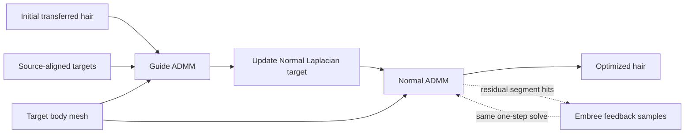

# HairADMM

**One-step, collision-aware ADMM post-processing for transferred hairstyles.**

HairADMM takes an initially transferred hairstyle, its source-aligned shape
targets, and a target body mesh. It preserves the transferred hairstyle with
QP-aligned fidelity, KNN Laplacian, and dynamic shape energies while enforcing
an exterior-body constraint through ADMM.

The public release contains exactly one algorithm configuration:

- one Guide/Normal solve pass;
- a 1 mm exterior-body margin;
- deterministic interior samples at no more than 2 mm spacing;
- exact Embree segment-triangle feedback;
- no Edge energy;
- no temporal gate and no second pass.

This is research code released to document and demonstrate the method. It is
not a production hair system and does not provide a strict global
non-collision guarantee.

## Method



Both stages use the ADMM splitting

```text
Cx = z,  z in exterior(body, 1 mm)

x <- argmin E(x) + rho/2 ||Cx - z + u||^2
z <- project_exterior_sdf(Cx + u)
u <- u + Cx - z
```

`C` contains every valid non-root hair point, uniform segment samples, and
additional samples around residual Embree intersections. Embree does not add a
second post-process: its samples are fed back into the same ADMM solve.

## Results

The complete evaluation covers 2,702 frames from seven hairstyle sequences.

| Metric | Init | QP baseline | HairADMM one-step |
| --- | ---: | ---: | ---: |
| Point penetrations | 1,275 | 442 | **15** |
| Segment intersections | 97,490 | 31,598 | **127** |
| Mean temporal acceleration | 0.635 mm | 1.125 mm | **0.603 mm** |
| Mean algorithm time | — | not retained | **4.119 s/frame** |

Relative to QP, HairADMM reduces point penetrations by **96.61%**, segment
intersections by **99.60%**, and mean temporal acceleration by **46.40%**.
The temporal metric is computed as
`||x[t+1] - 2 x[t] + x[t-1]||` on valid non-root points. No temporal term is
used in the released solver.

The QP runtime was not retained under the same timing protocol, so this
repository does not claim a measured runtime speedup over QP. Detailed metric
definitions and limitations are in [results/README.md](results/README.md).

## Installation

The tested implementation targets Linux and Python 3.10.

```bash
conda env create -f environment.yml
conda activate hairadmm
```

The core runtime uses NumPy, SciPy, libigl, trimesh, and Embree. No GPU is
required by the one-step solver.

## Run the redistributable toy demo

The repository includes a synthetic one-frame example with deliberately
penetrating strands and a triangulated sphere. The example is generated from
code and does not contain private human or hairstyle assets.

```bash
python examples/toy_case/run_demo.py
```

The demo begins with 8 interior non-root samples and 8 exact segment
intersections. Its verification step requires both counts to reach zero.

The optimized hair is written to:

```text
examples/toy_case/output/
├── hair/frame_0000.npz
├── hair/frame_0000.obj
└── metrics/frame_0000.json
```

## Run HairADMM on canonical problem bundles

```bash
python tools/run_hair_admm.py \
  --objective_tensor_dir /path/to/problem_bundles \
  --output_dir /path/to/output
```

The objective directory contains one `frame_XXXX.npz` per frame. Each bundle
uses metres and stores:

- initial transferred hair and source-aligned hair;
- variable strand topology and Guide strand indices;
- Guide and Normal KNN graphs, weights, and Laplacian targets;
- per-point fidelity/Laplacian weights;
- the target body triangle mesh;
- the three base energy weights.

The schema is validated by
[`hairs_adaption/qp_objective_bundle.py`](hairs_adaption/qp_objective_bundle.py).
Malformed or semantically incompatible bundles fail before optimization.

## View body and hair together

The demo command prepares a browser cache automatically. Start a local server:

```bash
cd tools/web
python -m http.server 8888
```

Open:

```text
http://localhost:8888/viewer.html?manifest=frames_toy_case.json
```

For another result sequence, build the cache with:

```bash
python tools/preprocess_strands_bin.py \
  --hair_dir /path/to/output/hair \
  --body_dir /path/to/body_objs \
  --out tools/web/cache/my_sequence \
  --manifest frames_my_sequence.json
```

Body files must be named `body_<frame>.obj`; hair files are named
`frame_<frame>.npz` or `frame_<frame>.obj`.

## Tests

```bash
python -m unittest discover -s tests -v
```

## Limitations

- HairADMM provides strong empirical collision reduction, not a mathematical
  global non-intersection guarantee.
- All 127 residual segment intersections in the measured release occur in the
  `girl_long` sequence.
- The one-step result contains a worst-case temporal outlier of 72.72 mm in
  `curly` frame 57, despite improving the global mean temporal metric.
- Results depend on the supplied objective tensors and on mesh orientation.

## License

The code is released under the [MIT License](LICENSE) as a research prototype,
without warranty. Dataset and model assets are not included.
